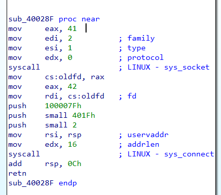
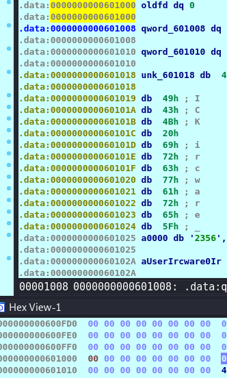
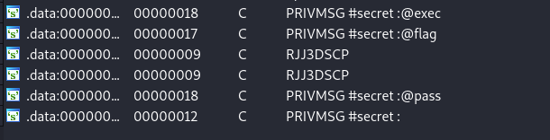
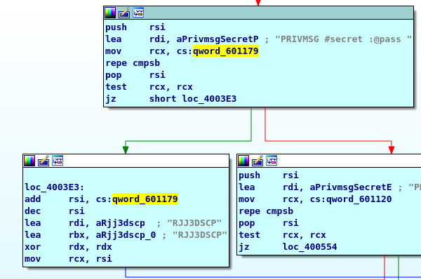
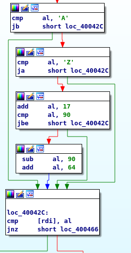
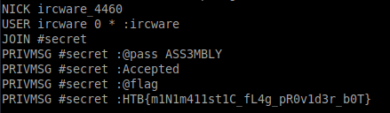

## ircware - reversing
The program tries to create a socket and to connect to a listener in order to communicate with it and act like a "pseudoterminal".



According to the x64 calling convention the first syscall looks like this :
```
syscall(41,2,1,0);
```
which calls:
```
socket(AF_INET, SOCK_STREAM, PF_UNSPEC)
```
creating an IPv4 socket.

As stated in the manpages, syscall() is a library function that :
> invokes the system
> call whose assembly language interface has the specified number
> with the specified arguments.

The second syscall looks like this :
syscall(42,oldfd(the file descriptor of the socket),127.0.0.1:8000,16) and further calls :
```
connect(oldfd,127.0.0.1:8000,16)
```

* 0x100007F is the little endian of 127.0.0.1
* 0x401f is the little endian of 8000(decimal)

A listener can be created using netcat in order to connect to the programs' pseudoterminal 

```
nc -l 8000
```


I find it easier if during debugging(I used IDA) I just flip a control register to bypass a conditional instruction(which checks if the connection was successfully established) and change the file descriptor to 0(stdin)
(this is the way i solved the challenge during the ctf)





In the strings tab I found these interesting commands:







In this part it is checked if the user types an available command. After that,
the program checks the length. If the string is longer than 24
it starts to further check the password part.

The password is "encoded" by the following algorithm. If the final form is "RJJ3DSCP" 
the user is "Accepted" and the flag can be requested.

```
if( A<= letter <=Z )
{
	letter += 17
	if(letter > 90)
	{
		letter = letter + 64 - 90
	}

}
```



The required form is obtained by inputting the string "ASS3MBLY"



